# RECON 

Lets start with our nmap scan 

lets scan for all open ports 

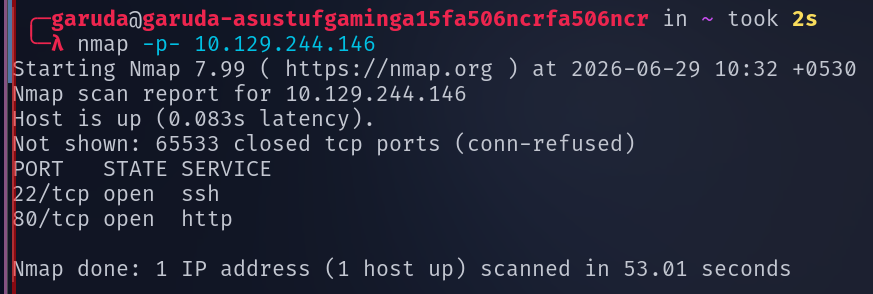

We Found two Open ports 22 ssh and 80 http , lets perform service verision scan and default script scan on them 

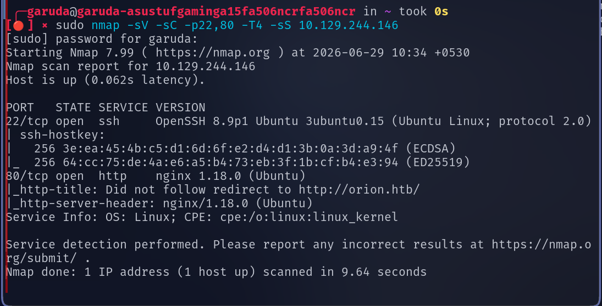

by accessing the ip on browser found the origin name as orion.htb , lets add that our /etc/hosts 

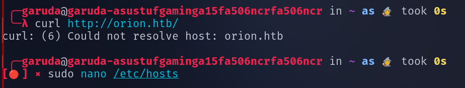

Lets visits the service running on port 80 as orion.htb

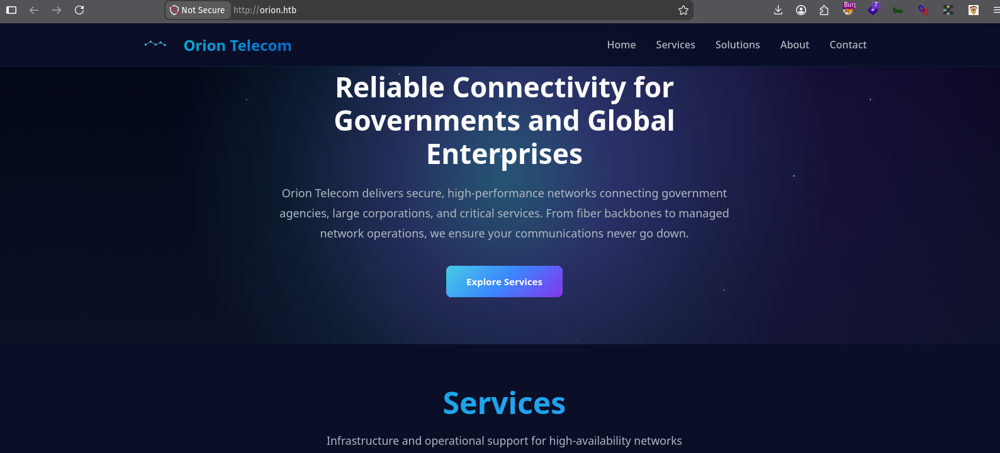

# ENEMURATION 

Lets use gobuster to enemurate the web direcotries 

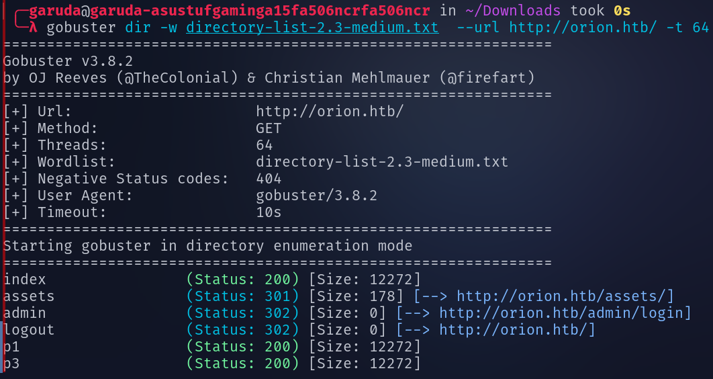

We found a intresing Directory named admin , lets access that 

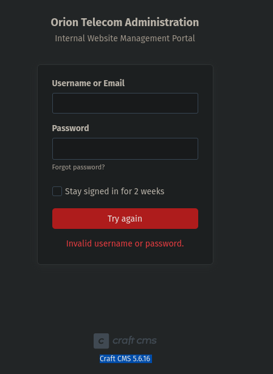

on below notice that we got information that  the page is made up craft cms and its verison is 5.6.16 , lets use exploitdb to search for the availabel exploit for this verison 

# EXPLOITATION 

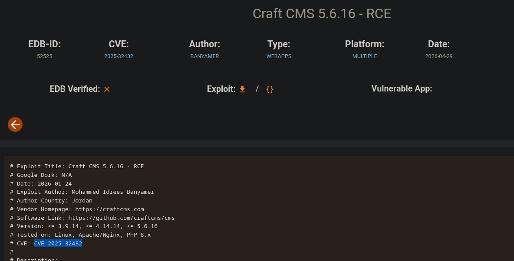

dowwnloaded the code and tried running but it does not seems to be working , so lets search for metasploit modules for craft cms 

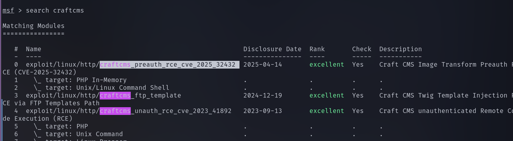

found our exploit , 

set RHOSTS , LHOSTS , and run the exploit 

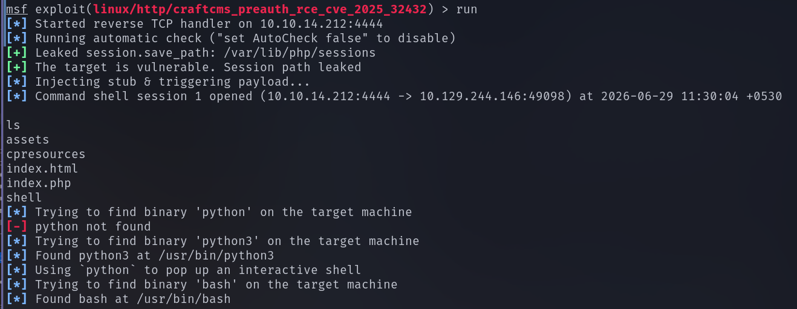

We successfully got the reverse shell 

after visiting some files and directories , in craft directory found an .env file , which containing username and password for sql database 

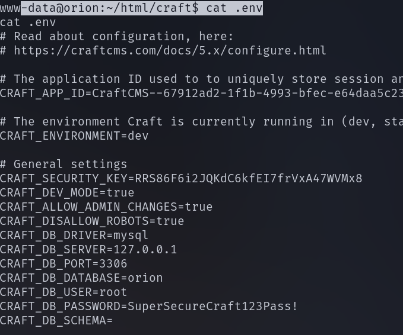

lets access the  database using the username and password we found 

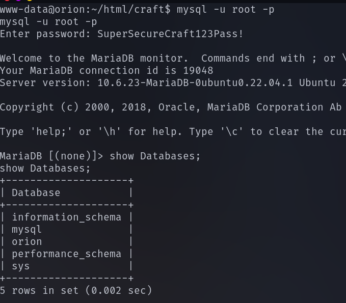

in orion database there is a table named users , lets list all the contents from the table 

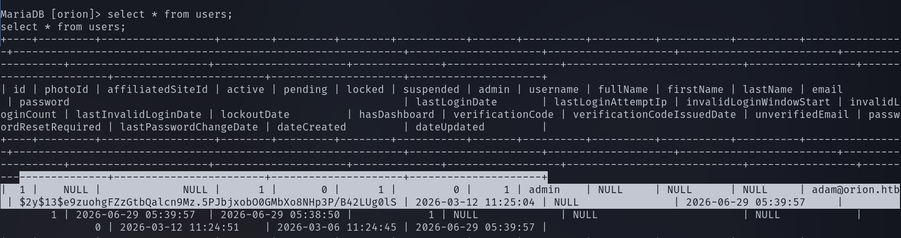

we found the user adam and password in hash format , lets use john to crack the hash 

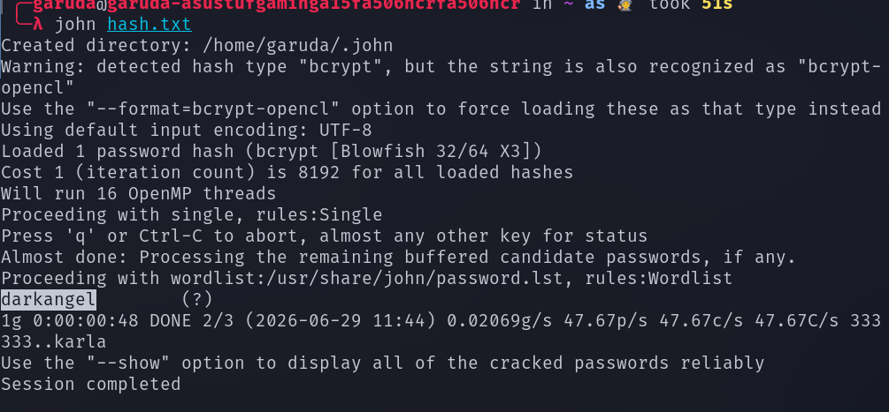

now we found the username and password and we know that ssh port is open , lets use this credentials to loing into ssh 

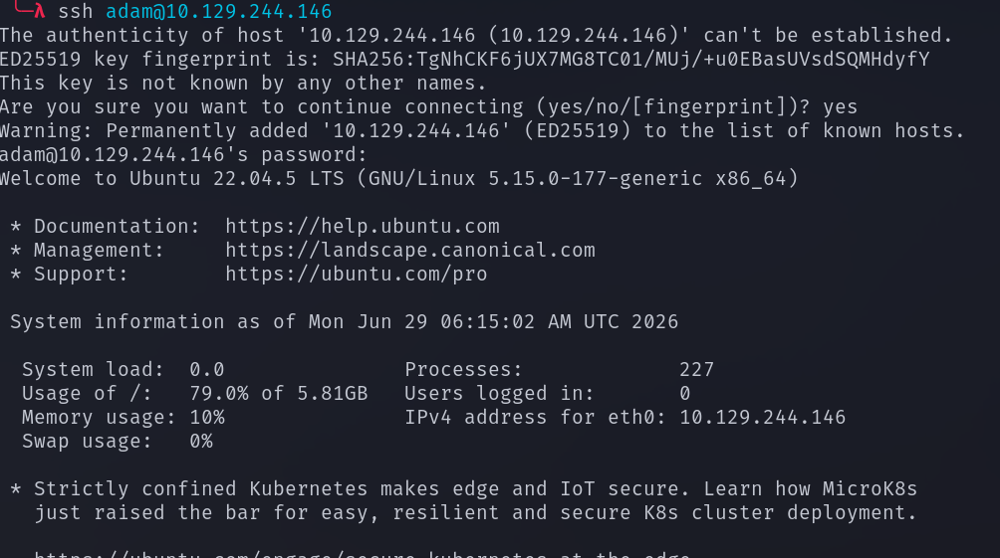

list the found , we found the user.txt file 

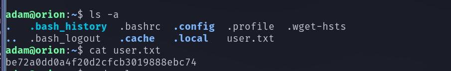

# PRIVILEGE ESCLATION 

Lets check the any ports that running internally 

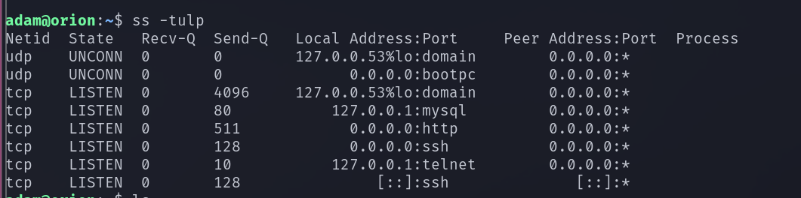

we found the telnet is running internally , lets check the telnet verison 

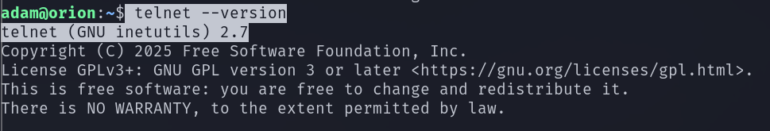

lets do a search for telnet verison 2 cves 

found an cve to esclate our privilege to root 

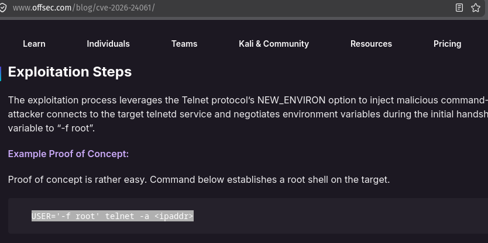

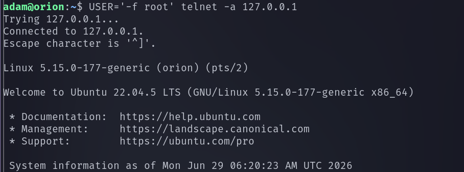

We successfully got the root shell 

lets visits the root.txt file 

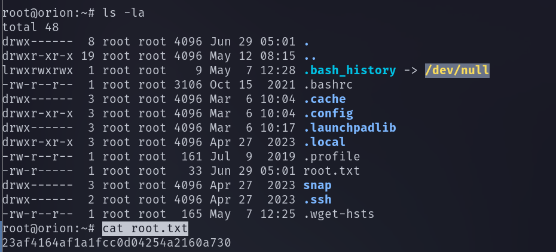

We successfully found the user flag and the root flag 

------------------------------------------------------------------THE END--------------------------------------------------------------------

